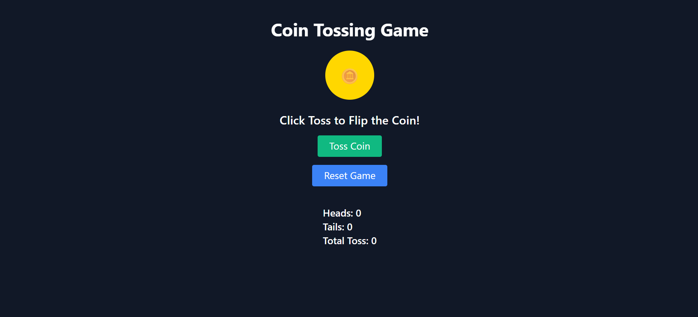

# 🪙 Coin Toss Game

A fun and interactive web application that simulates a coin toss! Users can flip a virtual coin and see whether it lands on heads or tails. The application keeps track of the number of heads and tails, providing a scoreboard for your tossing results.

## ✨ Features

- 🎲 **Coin Toss Simulation**: Click the "Toss Coin" button to flip the coin and get a random result.
- 📊 **Scoreboard**: Keeps track of the number of heads, tails, and total tosses.
- 🔄 **Reset Game**: Reset the game to start over and clear the scores.

## 💻 Technologies Used

- **HTML**: Structure of the web application.
- **Tailwind CSS**: For styling and responsive design.
- **JavaScript**: Handles the game logic, coin toss simulation, and score tracking.

## 🚀 Getting Started

### Prerequisites

- A web browser with JavaScript enabled.

### Installation

1. Clone the repo:
   ```sh
   git clone https://github.com/11Siya05/Coin-Toss
   ```
2. Open `index.html` in your browser.

## 🎮 How to Play

1. Click on the "Toss Coin" button to flip the coin.
2. The result of the toss (Heads or Tails) will be displayed.
3. The scoreboard will update with the number of heads, tails, and total tosses.
4. Click on the "Reset Game" button to clear the scores and start over.

## 📸 Screenshots




